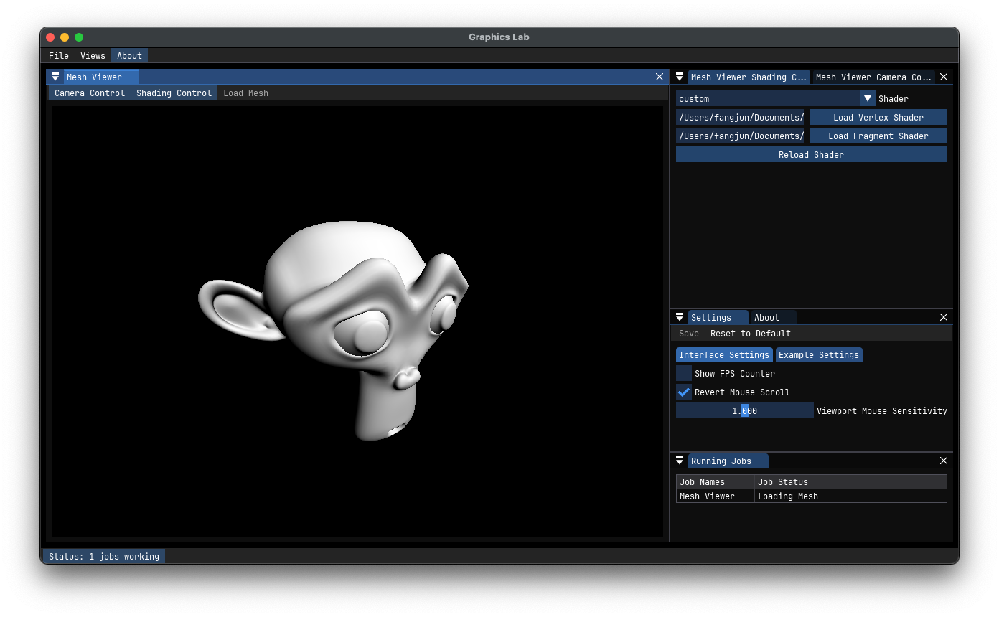

# ModernGL Playground



A experimental render environment with python moderngl library.

## Install

- Fork this project by

```bash
git clone git@github.com:fangjunzhou/moderngl-playground.git
```

- Install [uv](https://github.com/astral-sh/uv) with

```bash
pip install uv
```

- Inside the repository, run `uv sync` to install all the dependencies.

- Start the playground editor by

```bash
uv run start
```
